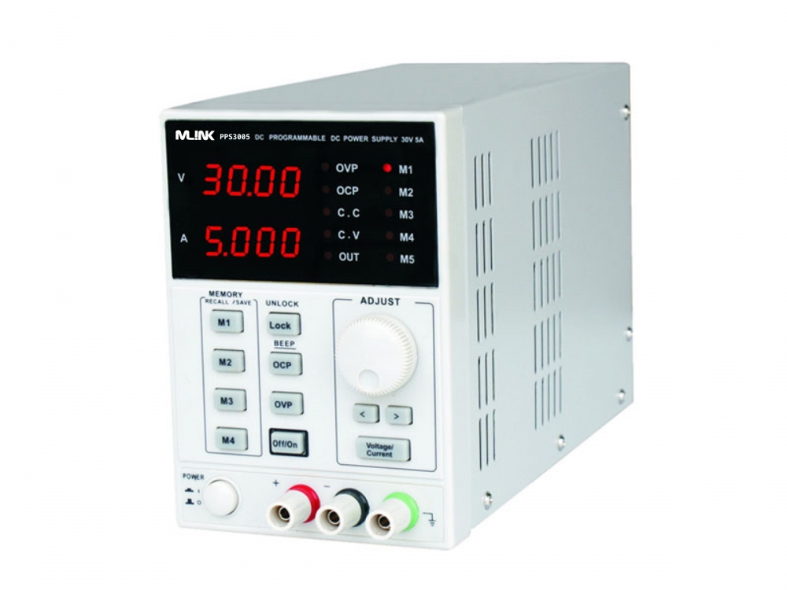

### PPS3005 Programmable Power Supply Controller
Small python module for controlling the PPS3005 PSU

### Overview


The PPS3005 is a programmable PSU, with a maximum voltage of 30V and maximum intensity of 5A. The protocol of this power supply is not documented and, at the moment of writing, no info could be found on the internet also.

With a little reverse engineering of the manufacturer's software, now it's possible to control this PSU with other means.

### Available methods
 * set_voltage(volts)
 ** Sets the PSU voltage to the specified one.
 * get_voltage()
 ** Gets the current voltage, with the format d.ddd
 * set_amps(amps)
 ** Sets the PSU current to the specified one.
 * get_amps()
 ** Gets the current current, with the format dd.dd
 * turn_on()
 ** Turns on PSU's output
 * turn_off()
 ** Turns off PSU's output
 * is_on()
 ** Returns if PSU's output is on
 
### Example

This example demonstrates the basic operation of the module. It creates an instance of the PSU, checks if it's on, turns it on, sets the voltage to 20V and finally closes the PSU port.

```python
from pps3005 import PPS3005

power_supply = PPS3005('COM14', 25, 2) # initialize PSU on COM14, 25V max and 2A max.

print('Is power supply output on? {}'.format(power_supply.is_on()))
print('Turn power supply output on')
power_supply.turn_on()
print('Is power supply output on? {}'.format(power_supply.is_on()))
print('Set power supply voltage to 20V')
power_supply.set_voltage(20)
print('Close power supply port')
del power_supply
```

Output:
```
PPS3005 successfully initialised on COM14
Max voltage: 25V
Max amps: 2A
Is power supply output on? False
Turn power supply output on
Is power supply output on? True
Set power supply voltage to 20V
Close power supply port
Successfully closed PSU port
```

This example is available [here](example.py)

### Contributors
 *  [@ResonantWave](https://github.com/ResonantWave)

### Contributing
* The code is licensed under the [GPL V3](LICENSE)
* Feel free to contribute to the code
